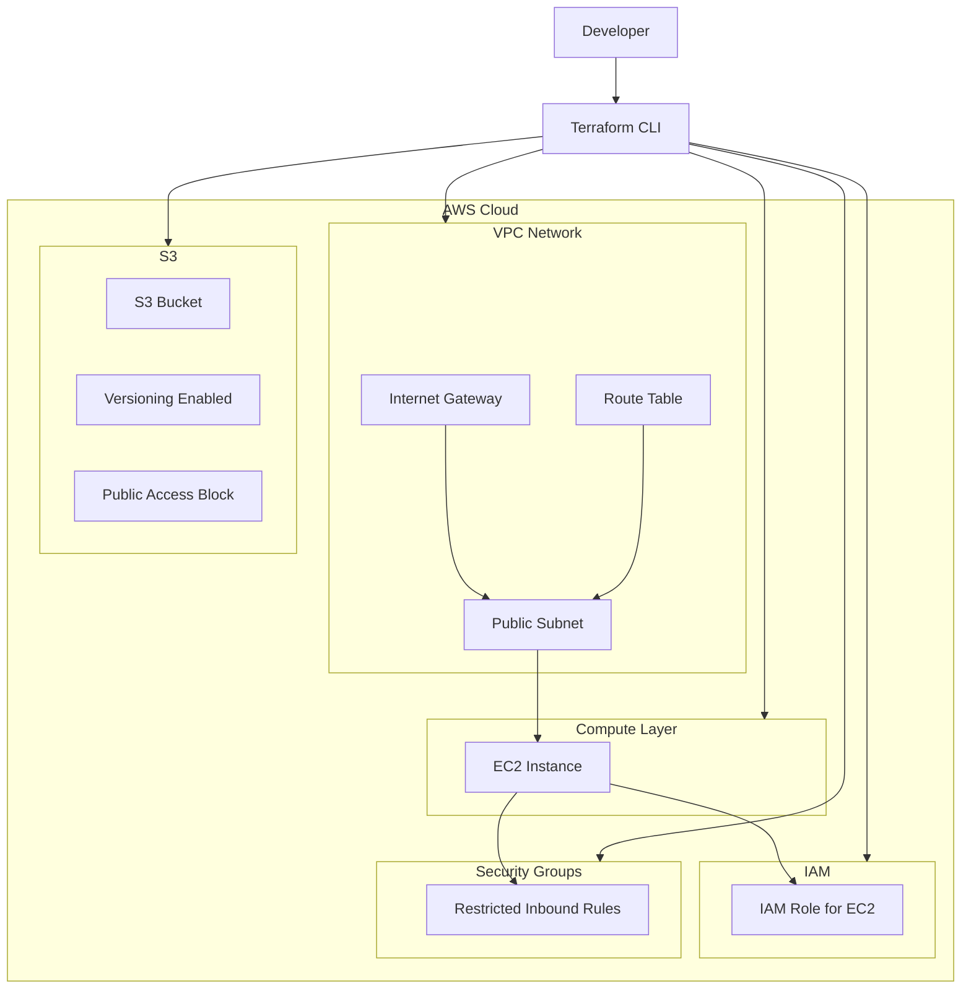

# Terraform Secure Infrastructure on AWS

## Project Overview

This project demonstrates provisioning secure AWS infrastructure using Terraform with a modular Infrastructure as Code (IaC) approach.

The goal of this project was to build reusable cloud infrastructure while applying security best practices and Terraform modules.

---

## Architecture

Infrastructure components deployed:

* Custom VPC
* Public subnet
* Internet Gateway
* Route Table configuration
* EC2 instance
* IAM Role for EC2
* Security Groups with restricted access
* S3 bucket with:

  * Versioning enabled
  * Public Access Block enabled
* Modular Terraform structure

---

## Security Features

* Infrastructure provisioned using Terraform (IaC)
* IAM role attached to compute resources
* S3 public access blocked
* Security Groups configured with limited inbound rules
* Network segmentation using VPC and subnet configuration
* Infrastructure split into reusable Terraform modules

---

## Project Structure

```text
terraform-secure-infrastructure/
│
├── modules/
│   ├── network/
│   │   ├── main.tf
│   │   ├── outputs.tf
│   │   └── variables.tf
│   │
│   └── ec2/
│       ├── main.tf
│       ├── outputs.tf
│       └── variables.tf
│
├── iam.tf
├── main.tf
├── outputs.tf
├── providers.tf
├── variables.tf
├── screenshots/
└── README.md
```

---

## Technologies Used

* Terraform
* AWS
* EC2
* IAM
* VPC
* S3
* Git
* GitHub

---

## Deployment

Initialize Terraform:

```bash
terraform init
```

Review infrastructure plan:

```bash
terraform plan
```

Deploy infrastructure:

```bash
terraform apply
```

---

## Screenshots

Project screenshots are available in:

```text
screenshots/
```

Included examples:

* Running Nginx instance
* VPC configuration
* Security Groups
* Internet Gateway
* Route Tables
* IAM Role
* S3 Public Access Block
* Terraform deployment

---

## Learning Outcomes

Through this project I practiced:

* Infrastructure as Code (IaC)
* Terraform modules
* AWS networking
* IAM configuration
* Cloud security concepts
* Infrastructure deployment automation
* Git and GitHub workflow

```


```
